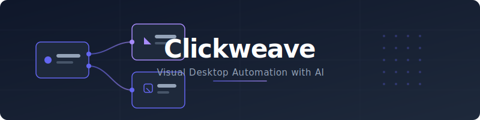
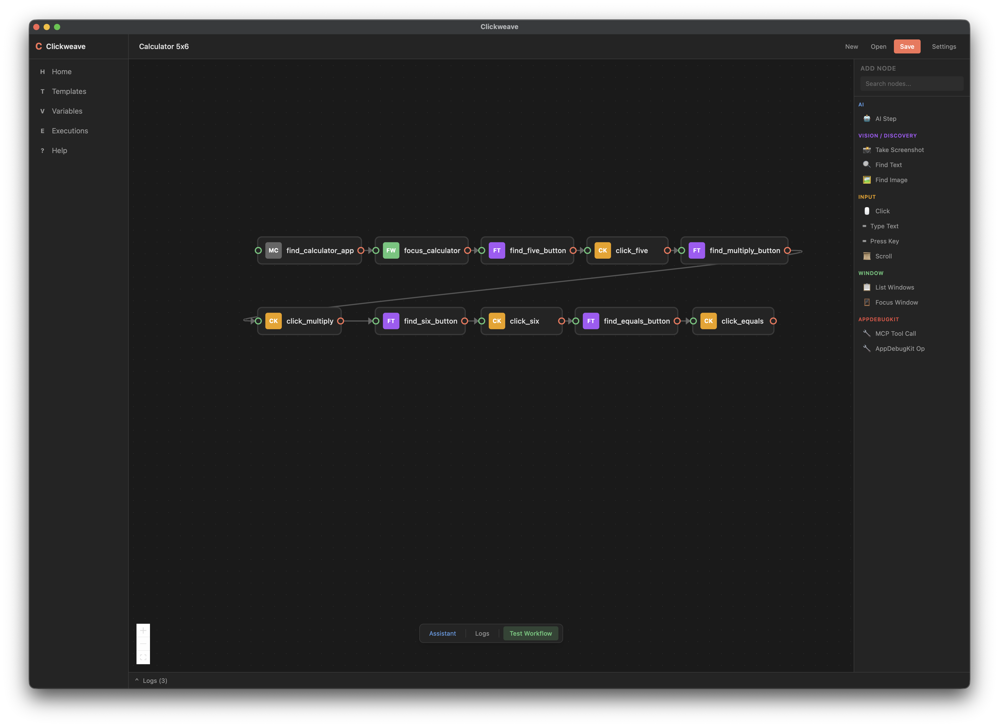

# Clickweave — Open-Source Desktop Automation with AI Planning


Clickweave is an open-source desktop automation platform that combines a visual workflow builder with AI-powered planning and execution. Build automations with drag-and-drop nodes, describe what you want in natural language, or mix both approaches. Clickweave acts as a computer use agent (CUA) — it can see your screen, click, type, and make decisions — while giving you full control over every step.

**Keywords:** desktop automation, UI automation, RPA, computer use agent, CUA, agentic workflow, visual workflow builder, AI automation, no-code automation, Model Context Protocol, MCP



> **Status:** Clickweave is in **early development**. Expect rapid changes, incomplete features, and breaking updates as core functionality is being built.



## Table of Contents

- [Features](#features)
- [How It Works](#how-it-works)
- [Architecture](#architecture)
- [Node Types](#node-types)
- [Use Cases](#use-cases)
- [Getting Started](#getting-started)
- [Configuration](#configuration)
- [Logs](#logs)
- [FAQ](#faq)
- [For AI Agents](#for-ai-agents)
- [License](#license)

## Features

### Visual Workflow Builder

A node-based graph editor for designing automation workflows. Add nodes from a categorized palette, connect them with edges, and configure each step through a detail modal with setup, checks, trace, and run history tabs. Supports multi-select, rubber-band selection, undo/redo, and visual loop grouping.

### AI Workflow Planning

Describe your automation goal in natural language and Clickweave generates a complete workflow graph. The planner:
- Converts intent into a sequence of typed nodes using available MCP tool schemas
- Generates deterministic **Tool** steps by default, with optional **AiStep** and **AiTransform** nodes
- Auto-repairs malformed LLM output with one-shot retry and error feedback
- Validates generated workflows against structural graph rules
- Supports lenient parsing — partial corruption doesn't discard the entire response

### AI Workflow Patching & Conversational Assistant

Modify existing workflows through conversation. The assistant panel lets you describe changes in natural language, and Clickweave generates patches that add, remove, or update nodes. Patches are staged for review before applying. The assistant validates patches against the workflow graph and retries with feedback when the result would be invalid.

### Control Flow

Workflows support branching and looping without scripting:
- **If** nodes evaluate conditions and take true/false paths
- **Switch** nodes match against multiple cases with a default fallback
- **Loop** nodes use do-while semantics — the body runs at least once before checking exit criteria
- **EndLoop** nodes jump back to their paired Loop node
- Node outputs are extracted into runtime variables that downstream nodes can reference in conditions

### Computer Use Agent (CUA)

Clickweave sees and interacts with the desktop via [native-devtools-mcp](https://github.com/anthropics/native-devtools-mcp), communicating over the [Model Context Protocol (MCP)](https://modelcontextprotocol.io/specification):
- **Visual perception:** screenshots, OCR text detection, image template matching
- **Interaction:** mouse clicks, keyboard input, scrolling, window management
- **Smart resolution:** LLM-assisted app-name and element-name resolution with caching and retry

### Post-Run Verification

Attach verification checks to any node:
- **Typed checks:** `TextPresent`, `TextAbsent`, `TemplateFound`, `WindowTitleMatches`
- **Expected outcome:** free-text description of what should happen after the node runs
- **VLM evaluation:** after a workflow completes, a vision-language model examines trace events and a post-execution screenshot against each check
- **Verdicts:** pass, fail, or warn — displayed in a verdict bar with expandable per-node breakdowns and VLM reasoning
- **Failure policy:** each check can be set to `FailNode` (hard stop) or `WarnOnly` (soft warning)

### Run History & Tracing

Every workflow execution is persisted with full traceability:
```
.clickweave/runs/<workflow_name>/<execution_dir>/<node_name>/
  run.json           # Execution metadata and status
  events.jsonl       # Newline-delimited trace events
  artifacts/         # Screenshots, OCR results, template matches
  verdict.json       # Check evaluation results
```
Browse past runs in the UI, inspect trace events, and preview captured artifacts.

### Pluggable AI Backends

Three independently configurable LLM endpoints (set in **Settings**):
- **Planner** — generates and patches workflows
- **Agent** — powers AI step execution during runs
- **VLM** (optional) — dedicated vision model for image analysis and check evaluation

All endpoints use the OpenAI-compatible `/v1/chat/completions` format. Works with local servers (LM Studio, vLLM, Ollama) or hosted providers (OpenRouter, OpenAI). No API key required for local endpoints.

### Local-First & Cross-Platform

Desktop actions run locally. LLM/VLM requests go only to the endpoints you configure (defaults to `localhost`). Built with Tauri v2, producing lightweight native apps for macOS, Windows, and Linux.

## How It Works

1. **Describe or build** — Type your automation goal in the planner or drag nodes onto the canvas
2. **Review the graph** — Inspect the generated workflow, tweak node parameters, add checks
3. **Execute** — Clickweave walks the graph node by node, driving tools via MCP
4. **Verify** — Post-run checks evaluate results with VLM-assisted screenshot analysis
5. **Iterate** — Use the assistant to patch workflows conversationally, or edit nodes directly

## Architecture

Clickweave is a Tauri v2 hybrid app with a Rust backend and a React frontend.

### Project Structure

```
/
├── crates/                 # Rust backend workspace
│   ├── clickweave-core/    # Workflow model, validation, runtime context, storage, tool mapping
│   ├── clickweave-engine/  # Workflow execution engine (graph walk, retries, AI steps, checks)
│   ├── clickweave-llm/     # LLM client, planning, patching, assistant, repair logic
│   └── clickweave-mcp/     # MCP JSON-RPC client (subprocess lifecycle, tool calls)
├── src-tauri/              # Tauri app shell & IPC commands
├── ui/                     # React frontend (Vite + Tailwind CSS v4)
│   ├── src/
│   │   ├── components/     # Graph canvas, nodes, modals, assistant, verdict bar
│   │   ├── store/          # Zustand state (8 slices: project, execution, assistant, history, settings, log, verdict, UI)
│   │   └── hooks/          # Keyboard shortcuts (undo/redo)
├── docs/                   # Reference & conceptual documentation
└── assets/                 # Static assets
```

### Frontend Stack

| Layer | Technology |
|-------|-----------|
| Framework | React 19 |
| Build | Vite 6 |
| Styling | Tailwind CSS v4 |
| Graph Editor | React Flow (`@xyflow/react`) |
| State | Zustand (slice composition) |
| Desktop Bridge | Tauri v2 (`@tauri-apps/api`) |
| Type Safety | Auto-generated TypeScript bindings via Specta |
| Tests | Vitest + Testing Library |

### Data Flow

**Planning:** UI → Tauri command → spawn MCP for tool discovery → LLM call → parse + validate → Workflow back to UI

**Execution:** UI → Tauri command → `WorkflowExecutor::run()` → spawn MCP server → walk graph (deterministic tools, AI loops, control flow) → stream `executor://` events to UI

## Node Types

| Category | Node | Description |
|----------|------|-------------|
| **AI** | AiStep | Agentic LLM + tool loop with configurable tool access and max calls |
| **Vision** | TakeScreenshot | Capture screen, window, or region with optional OCR |
| **Vision** | FindText | OCR-based text search (contains or exact match) |
| **Vision** | FindImage | Template matching with threshold and max results |
| **Input** | Click | Mouse click at coordinates or by target text (LLM-resolved) |
| **Input** | TypeText | Keyboard text input |
| **Input** | PressKey | Key press with modifiers (shift, control, option, command) |
| **Input** | Scroll | Scroll at position with delta |
| **Window** | ListWindows | Enumerate visible windows |
| **Window** | FocusWindow | Bring window to front by app name, window ID, or PID |
| **Control Flow** | If | Conditional branch (evaluates runtime variables) |
| **Control Flow** | Switch | Multi-way branch with named cases and default |
| **Control Flow** | Loop | Do-while loop with max iteration bound |
| **Control Flow** | EndLoop | Jump back to paired Loop node |
| **Extensibility** | McpToolCall | Generic invocation of any MCP tool by name |

### Node Configuration

Each node supports:
- **Retries** (0–10) with automatic re-execution and cache eviction on failure
- **Timeout** (ms) for bounded execution
- **Settle delay** (ms) for waiting after execution
- **Trace level** (Off / Minimal / Full) for controlling artifact capture
- **Expected outcome** — human-readable description for VLM verification
- **Enabled toggle** — skip nodes without removing them

## Use Cases

- **Desktop RPA** — Automate repetitive back-office workflows across multiple desktop applications
- **QA & Regression Testing** — Build smoke and regression test flows with screenshots, OCR verification, and run traces for debugging
- **AI-Assisted Automation** — Let AI plan workflows from natural language, then keep deterministic execution where precision matters
- **Visual Verification** — Attach checks to nodes and let a VLM verify expected outcomes from screenshots
- **Local-First Automation** — Run against local LLM/VLM endpoints for privacy-sensitive workflows
- **Cross-App Workflows** — Chain actions across multiple desktop applications with window management and conditional branching

## Getting Started

### Prerequisites

1. **Rust** >= 1.85 — [Install Rust](https://www.rust-lang.org/tools/install)
2. **Node.js** (LTS) — [Install Node.js](https://nodejs.org/)
3. **Tauri CLI:**
    ```bash
    cargo install tauri-cli --locked
    ```
4. **OS dependencies:**
    - **macOS:** Xcode Command Line Tools (`xcode-select --install`)
    - **Windows:** [Visual Studio C++ Build Tools](https://visualstudio.microsoft.com/visual-cpp-build-tools/) + [WebView2 Runtime](https://developer.microsoft.com/en-us/microsoft-edge/webview2/)
    - **Linux (Ubuntu/Debian):**
        ```bash
        sudo apt-get update
        sudo apt-get install libwebkit2gtk-4.1-dev build-essential curl wget file libxdo-dev libssl-dev libayatana-appindicator3-dev librsvg2-dev
        ```

### Install & Run

```bash
# Clone the repository
git clone https://github.com/sh3ll3x3c/clickweave.git
cd clickweave

# Install frontend dependencies
npm install --prefix ui

# Run in development mode
cargo tauri dev

# Build for production
cargo tauri build
```

Output bundles will be in `target/release/bundle/`.

### Running Tests

```bash
# Rust tests
cargo test

# Frontend tests
npm test --prefix ui
```

## Configuration

### AI Endpoints

Configure in **Settings** within the app. Each endpoint takes:
- **Base URL** (default: `http://localhost:1234/v1`)
- **Model name** (default: `local`)
- **API key** (optional, empty for local endpoints)

### MCP Server

The MCP command can be set to:
- `"npx"` (default) — runs `npx -y native-devtools-mcp`
- A custom binary path for self-hosted MCP servers

### Model Info Detection

At workflow startup, Clickweave queries the inference provider for model metadata (context length, architecture, quantization).

| Provider | Context Length Field | Endpoint |
|----------|---------------------|----------|
| LM Studio | `max_context_length`, `loaded_context_length` | `/api/v0/models` |
| vLLM | `max_model_len` | `/v1/models` |
| OpenRouter | `context_length` | `/v1/models` |
| Ollama | Not supported yet | — |
| OpenAI | Not available via API | — |

### Feature Flags

Toggle in **Settings**:
- **Allow AI Transforms** (default: on) — enables AiTransform in planner output
- **Allow Agent Steps** (default: off) — enables full agentic loops with tool access

## Logs

JSON-formatted trace logs with full LLM request/response bodies and tool call details.

| Platform | Location |
|----------|----------|
| macOS | `~/Library/Logs/Clickweave/` |
| Windows / Linux | `./logs/` (relative to working directory) |

Log files: `clickweave.YYYY-MM-DD.txt`. Console level defaults to `info` (override with `RUST_LOG`). File layer always captures at `trace` level.

## FAQ

### What is Clickweave?
Clickweave is an open-source desktop automation platform that acts as a computer use agent. It combines a visual node-based workflow builder with AI-powered planning and execution for automating UI tasks on macOS, Windows, and Linux.

### How does Clickweave automate the desktop?
Clickweave drives desktop interactions through the [Model Context Protocol (MCP)](https://modelcontextprotocol.io/specification) by spawning [native-devtools-mcp](https://github.com/anthropics/native-devtools-mcp) as a subprocess. This provides screenshots, OCR, mouse/keyboard control, and window management — all without injecting code into target applications.

### Does Clickweave require coding?
No. You can build workflows visually with drag-and-drop nodes, use natural-language prompts for AI-assisted planning and patching, or combine both approaches.

### What is a computer use agent (CUA)?
A computer use agent is software that can see and interact with a computer's graphical interface — taking screenshots, reading text via OCR, clicking buttons, and typing — to accomplish tasks autonomously or semi-autonomously. Clickweave is a CUA that gives you a visual editor to control what the agent does.

### Which AI model providers does Clickweave support?
Any provider with an OpenAI-compatible `/v1/chat/completions` endpoint: LM Studio, vLLM, Ollama (OpenAI-compatible mode), OpenRouter, OpenAI, and others. You can use different models for planning, execution, and vision tasks.

### Is Clickweave local-first? Does it send my data to the cloud?
Yes, Clickweave is local-first. Desktop automation actions run entirely on your machine. LLM/VLM requests are sent only to the endpoints you configure — which default to `localhost`. No telemetry, no cloud dependency.

### How does Clickweave compare to traditional RPA tools?
Traditional RPA tools rely on selectors, DOM scraping, or accessibility APIs tied to specific applications. Clickweave uses visual perception (screenshots + OCR + template matching) and can automate any application with a visible UI. The AI planner means you can describe what you want rather than manually scripting every click.

### Can Clickweave handle conditional logic and loops?
Yes. Clickweave supports If, Switch, and Loop control-flow nodes. Node outputs are extracted into runtime variables that conditions and loops can reference, so workflows can branch and repeat without scripting.

### How does workflow verification work?
You can attach typed checks (TextPresent, TextAbsent, TemplateFound, WindowTitleMatches) and free-text expected outcomes to any node. After a workflow completes, a vision-language model examines trace events and post-execution screenshots to produce pass/fail/warn verdicts for each check.

### What is MCP and why does Clickweave use it?
The [Model Context Protocol (MCP)](https://modelcontextprotocol.io/specification) is a standard for connecting AI models to external tools. Clickweave uses MCP to decouple its orchestration engine from specific automation backends — the same workflow graph can drive different MCP servers without changing the workflow definition.

## For AI Agents

This section helps AI agents navigate and understand the codebase.

**Key Entry Points:**
- **Planner:** `crates/clickweave-llm/src/planner/plan.rs` — `plan_workflow` / `plan_workflow_with_backend`
- **Patcher:** `crates/clickweave-llm/src/planner/patch.rs` — workflow patch generation
- **Assistant:** `crates/clickweave-llm/src/planner/assistant.rs` — conversational assistant with patch validation retry
- **Execution Loop:** `crates/clickweave-engine/src/executor/run_loop.rs` — core graph walk
- **MCP Protocol:** `crates/clickweave-mcp/src/protocol.rs` — JSON-RPC implementation
- **Frontend State:** `ui/src/store/useAppStore.ts` — main Zustand store
- **Tauri Commands:** `src-tauri/src/commands/` — IPC bridge

**Conventions:**
- Error handling: internal crates use `anyhow::Result`; Tauri boundaries return `Result<_, String>`
- Async: `tokio` runtime
- Tracing: `tracing` crate for structured logging
- Types: Specta + tauri-specta for auto-generated TypeScript bindings

**Documentation:** See `docs/` for reference docs (code-coupled, agent-oriented) and conceptual docs (architecture mental models).

## License

Distributed under the MIT License. See [LICENSE](LICENSE) for more information.
