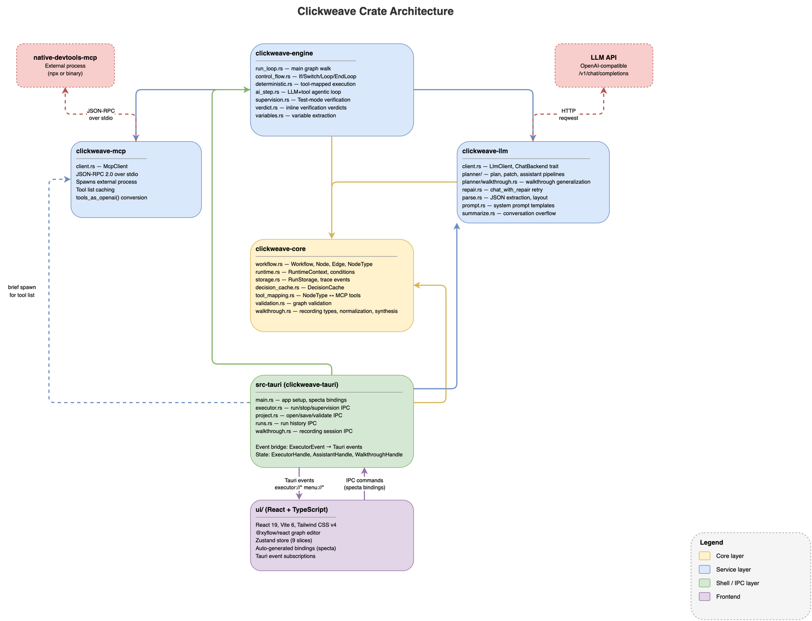

# Architecture Overview (Conceptual)

Clickweave has one core idea: describe desktop automation as a graph, then execute that graph reliably with observable state.

## Mental Model

1. A user starts with intent.
2. The planner turns intent into a workflow graph.
3. The user reviews/edits the graph visually.
4. The executor walks the graph and drives tools. In Test mode, each step is verified by a supervision loop that can pause execution and let the user retry, skip, or abort. In Run mode, execution proceeds without supervision, replaying decisions recorded during Test.
5. Results, traces, and checks feed back into iteration.

## Layered System

- Core model layer: workflow graph types and validation rules.
- Planning layer: translates natural language into graph structures.
- Execution layer: runs deterministic tool steps and AI-agentic steps.
- Supervision layer: after each step, a VLM captures the screen state and a supervision LLM judges whether the step succeeded. On failure, execution pauses and the user can retry, skip, or abort. Active in Test mode only.
- Integration layer: MCP bridge to external automation tools.
- UI layer: canvas editor + run/trace/assistant UX.

## Why This Split Exists

- Deterministic nodes make runs inspectable. Many involve LLM calls at resolution time (element disambiguation, app name resolution), so true replay depends on the decision cache recording those choices during Test and replaying them in Run.
- Agentic nodes handle ambiguity when strict tool calls are not enough.
- Control-flow nodes let workflows encode decision logic without scripting.
- Trace + checks create a feedback loop for reliability.

## Reliability Strategy

The system assumes LLM output and runtime environments are imperfect, so it uses:

- graph validation before execution,
- retry/repair loops for planning and patching,
- runtime retries with cache eviction,
- step-level supervision in Test mode, where a VLM + supervision LLM verify each step's outcome and pause for human judgment on failure,
- a decision cache that records LLM-driven choices (element disambiguation, app resolution) during Test, then replays them deterministically in Run,
- persisted traces and artifacts for diagnosis.

The two execution modes reflect this strategy: Test mode is interactive, with supervision and decision recording; Run mode is hands-off, replaying cached decisions without supervision overhead.

## What Humans Should Keep in Mind

- A workflow is not a script text file; it is a typed graph.
- Planning and execution are separate responsibilities.
- "Success" is not only node completion; checks and observed outcomes matter.
- The assistant is for acceleration, not bypassing validation.

For code-coupled details, see `docs/reference/architecture/overview.md`.
