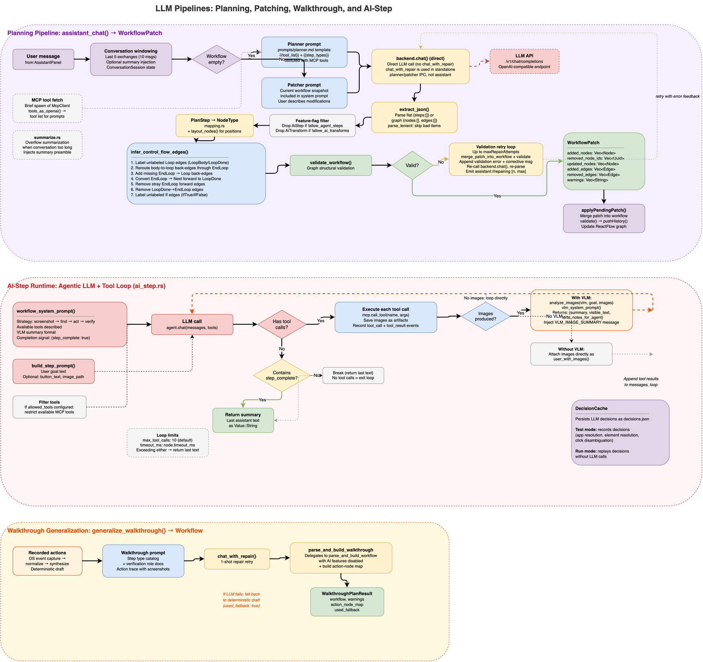

# Planning & Retries (Conceptual)

LLM output is probabilistic; workflow execution must be dependable. The planner therefore treats LLM output as input to be repaired, filtered, and validated.

## Four Pipelines

The LLM layer has four distinct entry points:

- **Planner** -- generates a full workflow from a user intent description (empty canvas).
- **Patcher** -- modifies an existing workflow based on a user instruction. The current workflow snapshot is included in the system prompt so the LLM knows what already exists.
- **Assistant** -- the conversational interface that dispatches to planner (if workflow is empty) or patcher (if workflow has nodes). Maintains a windowed conversation history (last 5 exchanges) with overflow summarization.
- **Walkthrough generalization** -- takes a recorded walkthrough (a sequence of observed user actions with screenshots) and generalizes it into a structured workflow. Uses the planner's step type catalog and verification role documentation. Falls back to the deterministic draft if LLM generalization fails.

The first three produce a `WorkflowPatch` that the UI merges into the current workflow. The walkthrough pipeline produces a full `Workflow` plus an action-node map linking original recorded actions to generated nodes.

## Repair Strategy in Plain Terms

1. Try to parse what the model produced.
2. If structurally wrong, ask exactly once for corrected JSON (`chat_with_repair` -- a fixed 1-shot retry, not configurable).
3. Keep valid pieces, skip malformed pieces via lenient parsing, and surface warnings. Unknown step types are silently dropped rather than failing the whole response.
4. Infer missing control-flow edges (label unlabeled Loop/If edges, add missing EndLoop back-edges, reroute stray edges).
5. Validate the final graph before accepting it.
6. In assistant mode, if validation fails and `maxRepairAttempts > 0`, append the validation errors as feedback and retry with the LLM (up to N-1 retries). The UI sees `assistant://repairing` events during this loop.

## Why Multiple Layers

A single retry mechanism is not enough:

- parsing issues need formatting repair (layer 2),
- partial corruption should not discard the entire response (layer 3),
- LLMs frequently produce structurally valid but semantically incorrect control-flow edges (layer 4),
- structural graph issues need validation-aware feedback that includes the specific error (layer 5-6).

## Verification Role in Planning

The planner prompt includes a Verification role section: any read-only Tool step (`find_text`, `find_image`, `list_windows`, `take_screenshot`) can be marked `"role": "Verification"` to act as a test assertion. `take_screenshot` additionally requires an `expected_outcome` for VLM evaluation. Verification failures are fail-fast during execution.

## Product Outcome

Users still get fast AI-assisted planning, but unsafe graph states are blocked before execution. The walkthrough pipeline provides an alternative path: demonstrate the task first, let the LLM generalize the recording into a structured workflow, then review and refine.

For implementation-level behavior, see `docs/reference/llm/planning-retries.md`.
